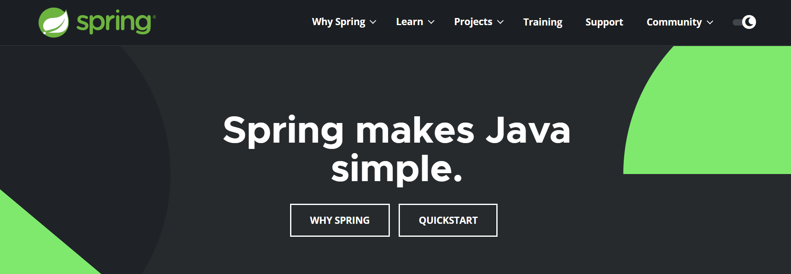

# Spring

## 目录

* [1. 什么是 Spring?](#1-----spring-)
  + [1.1 Spring 核心](#11-spring---)
  + [1.2 Spring 发展历程](#12-spring-----)
  + [1.3 Spring 优势](#13-spring---)
  + [1.4 Spring 体系结构](#14-spring-----)
* [2. 程序的耦合和解耦](#2---------)
  + [2.1 问题回顾](#21-----)
  + [2.2 工厂模式解耦](#22-------)
* [3. IOC](#3-ioc)
  + [3.1 什么是 IOC？](#31-----ioc-)
  + [3.2 Spring 中的 IOC](#32-spring----ioc)
  + [3.3 Spring 基于 XML 的 IOC 环境搭建](#33-spring----xml---ioc-----)
* [4. 依赖注入](#4-----)


## 1. 什么是 Spring?

Spring 框架是一个开源的 [J2EE](https://baike.baidu.com/item/J2EE/110838) 应用程序框架，针对bean的生命周期进行管理的轻量级容器





### 1.1 Spring 核心

1. `IOC` 控制反转
2. `AOP` 面向切片

### 1.2 Spring 优势

1. 方便解耦，简化开发

   通过 Spring 提供的 `IoC` 容器，我们可以将对象之间的依赖关系交由 Spring 进行控制，避免硬编码所造成的过度程序耦合。有了 Spring，用户不必再为单实例模式类、属性文件解析等这些很底层的需求编写代码，可以更专注于上层的应用。

2. `AOP` 编程支持

   通过Spring提供的[AOP](https://baike.baidu.com/item/AOP)功能，方便进行面向切面的编程，许多不容易用传统OOP实现的功能可以通过AOP轻松应付。

3. 声明式事务支持

   在 Spring 中，我们可以从单调烦闷的事务管理代码中解脱出来，通过声明式方式灵活地进行事务的管理，提高开发效率和质量。

4. 方便程序测试

   Spring 对 `Junit4` 支持，可以通过注解方便的测试 Spring 程序。

5. 方便集成各种优秀框架

   Spring 不排斥各种优秀的开源框架，相反，Spring 可以降低各种框架的使用难度，Spring 提供了对各种优秀框架等的直接支持。

6. Java 源码经典学习范例

   Spring 的源码设计精妙、结构清晰、匠心独运，处处体现着大师对 [Java设计模式](https://baike.baidu.com/item/Java设计模式)灵活运用以及对 Java 技术的高深造诣。Spring 框架源码无疑是 Java 技术的最佳实践范例。如果想在短时间内迅速提高自己的 Java 技术水平和应用开发水平，学习和研究 Spring 源码将会使你收到意想不到的效果。


### 1.3 Spring 体系结构

 


## 2. 程序的耦合和解耦

### 2.1 什么是耦合

耦合指的是程序之间的依赖关系，分为：

1. 类之间依赖
2. 函数方法依赖


### 2.2 什么是解耦

降低程序的耦合性，使得 **编译期不依赖，运行时才依赖**

方法：

1. 使用反射创建对象，避免使用 `new` 
2. 读取配置文件获取创建对象全限定类命


### 2.3 问题回顾

在之前我们保存用户信息都是这么做的：

**View.java**

```java
package com.ceezyyy.view;

import com.ceezyyy.service.UserService;
import com.ceezyyy.service.impl.UserServiceImpl;

public class View {
    public static void main(String[] args) {
        UserService userService = new UserServiceImpl();
        userService.save();
    }
}

```


**UserService.java**

```java
package com.ceezyyy.service;

public interface UserService {
    void save();
}

```


**UserServiceImpl.java**

```java
package com.ceezyyy.service.impl;

import com.ceezyyy.dao.UserDao;
import com.ceezyyy.dao.impl.UserDaoImpl;
import com.ceezyyy.service.UserService;

public class UserServiceImpl implements UserService {
    private UserDao userDao = new UserDaoImpl();

    public void save() {
        userDao.save();
    }
}

```


这样程序依赖很强，当我们移除了 `userDaoImpl.java` ，程序在编译期间就无法通过

 

### 2.4 工厂模式解耦

#### 


## 3. IOC


### 3.1 什么是 IOC？


### 3.2 Spring 中的 IOC


### 3.3 Spring 基于 XML 的 IOC 环境搭建


## 4. 依赖注入


