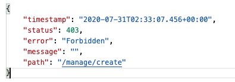
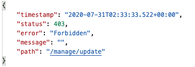
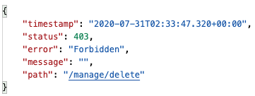

# Spring Security

Table of Contents
=================

* [1. Quickstart](#1-quickstart)
* [2. Basic Auth](#2-basic-auth)
* [3. Users Roles and Authorities](#3-users-roles-and-authorities)
   * [3.1 User service](#31-user-service)
   * [3.2 Password](#32-password)
* [4. Role Based Authentication](#4-role-based-authentication)
* [5. Permission Based Authentication](#5-permission-based-authentication)
* [6. Cross-site request forgery (CSRF)](#6-cross-site-request-forgery-csrf)
* [7. Form Based Authentication](#7-form-based-authentication)
* [8. Database Authentication](#8-database-authentication)
* [9. JWT](#9-jwt)
* [10. Conclusion](#10-conclusion)
* [源码](#源码)
* [参考资料](#参考资料)


## 1. Quickstart

添加依赖

**pom.xml**

```xml
<dependencies>
  <dependency>
    <groupId>org.springframework.boot</groupId>
    <artifactId>spring-boot-starter-security</artifactId>
  </dependency>
  <dependency>
    <groupId>org.springframework.boot</groupId>
    <artifactId>spring-boot-starter-web</artifactId>
</dependency>
```

`controller` 层

**HelloController.java**

```java
@RestController
public class HelloController {

    @RequestMapping("/")
    public String sayHello() {
        return "Hello!";
    }
    
}
```

配置端口为 9090

```yaml
server:
  port: 9090
```

当 `url` 输入以下网址时

<div align="center">  </div><br>

页面变成了

<div align="center">  </div><br>


可见，我们的接口没有赤裸裸地暴露供第三方随意访问了，`spring security` 框架给我们加了一层保护

用户名默认为 `user`

密码从控制台可以获得

<div align="center">  </div><br>

成功跳转！

<div align="center">  </div><br>


⚠️注意：

`login` 之后默认跳转到 `/` 路径


## 2. Basic Auth

集成 `Spring Security`

**ApplicationSecurityConfig.java**

```java
@Configuration
@EnableWebSecurity
public class ApplicationSecurityConfig extends WebSecurityConfigurerAdapter {
    @Override
    protected void configure(HttpSecurity http) throws Exception {
        http
                .authorizeRequests()
                .anyRequest()
                .authenticated()
                .and()
                .httpBasic();
    }
}
```

继承了 `WebSecurityConfigurerAdapter`，我们重写了 `configure` 方法（参数为 `HttpSecurity`）

解释一下编写思路（编写时会有代码提示）

对发过来的 `http request`

1. 授权请求
2. 所有请求
3. 都要验证
4. 和
5. 使用 `http basic` 验证方式


<div align="center">  </div><br>

修改 `controller`

**HelloController.java**

```java
@RestController
public class HelloController {

    @RequestMapping("/hello")
    public String sayHello() {
        return "Hello!";
    }

}
```


成功访问！


<div align="center">  </div><br>

## 3. Users Roles and Authorities

### 3.1 User service

在安全领域

用户包括一般包括以下信息：

- username
- password
- role
- authorities
- and more

`username` 和 `password` 很好理解，我们无论登录哪个网站，都需要用户名和密码来校验我们的身份

`role` 和 `authorities` 又如何理解呢？

我们在生活中有许多身份，在学校我们既是学生，也是父母的孩子，说不定还是校篮球队队长

权限一般与角色一起谈论。比如说你是学生，你可以享受教育优惠的权限，你可以享受在高中大学读书的权利...

你是篮球队队长，你就有组织训练的权限，有管理队员的权限...

<div align="center">  </div><br>


`Spring security` 默认的用户是 `user`

```java
@Configuration
@EnableWebSecurity
public class ApplicationSecurityConfig extends WebSecurityConfigurerAdapter {

    @Autowired
    private PasswordEncoder passwordEncoder;

    /**
     * 配置用户信息
     *
     * @return
     */
    @Override
    @Bean
    protected UserDetailsService userDetailsService() {

        // user 1: admin
        UserDetails admin = User.builder()
                .username("admin")
                .password(passwordEncoder.encode("123"))
                .roles(ADMIN.name())
                .build();

        // user 2: visitor
        UserDetails visitor = User.builder()
                .username("visitor")
                .password(passwordEncoder.encode("123"))
                .roles(VISITOR.name())
                .build();


        return new InMemoryUserDetailsManager(admin, visitor);

    }

    @Override
    protected void configure(HttpSecurity http) throws Exception {
        http
                .csrf().disable()
                .authorizeRequests()
                .antMatchers("/index").permitAll()
                .antMatchers("/admin").hasRole(ADMIN.name())
                .antMatchers("/visitor").hasRole(VISITOR.name())
                .anyRequest()
                .authenticated()
                .and()
                .httpBasic();
    }
}
```


解释（具体查看源码）：

- User：用户类
- UserDetails：用户信息类
- InMemoryUserDetailsManager：用户信息保存在内存


这里有一个小技巧，方法返回值是 `UserDetailsService`

是一个接口，点击左边绿色图标可以查看其实现类

<div align="center">  </div><br>


总的来说，用户信息配置类通过工厂模式创建了一个用户信息对象，并保存在内存中


### 3.2 Password

作为一个企业级安全框架，是决不允许密码以明文形式存储

`Spring security` 为我们提供了一个利器：`PasswordEncoder`

**PasswordEncoder.class**

```java
public interface PasswordEncoder {
    String encode(CharSequence var1);

    boolean matches(CharSequence var1, String var2);

    default boolean upgradeEncoding(String encodedPassword) {
        return false;
    }
}
```

采用第三种加密方式：

<div align="center">  </div><br>

**PasswordConfig.java**

```java
@Configuration
public class PasswordConfig {

    @Bean
    public PasswordEncoder passwordEncoder() {
        return new BCryptPasswordEncoder(10);
    }

}
```


<div align="center">  </div><br>

debug 一下，发现明文密码 “123” 已经加密


成功访问！

<div align="center">  </div><br>


## 4. Role Based Authentication

**一句话概括：你拥有什么身份，就访问特定身份的网址**


模拟两个角色：

- admin（拥有增删改查的权限）
- visitor （只有查的权限）


<div align="center">  </div><br>


为了方便理解，在用户信息中设置两个角色：

- admin
- visitor


权限枚举类：

**UserPermission.java**

```java
public enum UserPermission {

    CREATE("create"),
    READ("read"),
    UPDATE("update"),
    DELETE("delete");

    private final String permission;

    UserPermission(String permission) {
        this.permission = permission;
    }

    public String getPermission() {
        return permission;
    }

}
```

角色枚举类：

**UserRole.java**

```java
public enum UserRole {

    // 使用 guava 工具类简化代码
    ADMIN(Sets.newHashSet(UserPermission.READ)),
    VISITOR(Sets.newHashSet(UserPermission.CREATE, UserPermission.READ, UserPermission.UPDATE, UserPermission.DELETE));

    private final Set<UserPermission> permissionSet;

    UserRole(Set<UserPermission> permissionSet) {
        this.permissionSet = permissionSet;
    }

    public Set<UserPermission> getPermissionSet() {
        return permissionSet;
    }
    
}
```

权限枚举类：

**UserPermission.java**

```java
public enum UserPermission {

    CREATE("create"),
    READ("read"),
    UPDATE("update"),
    DELETE("delete");

    private final String permission;

    UserPermission(String permission) {
        this.permission = permission;
    }

    public String getPermission() {
        return permission;
    }

}
```

不同的 `request` 对应着不同的角色

**ApplicationSecurityConfig.java**

```java
@Override
protected void configure(HttpSecurity http) throws Exception {
  http
    .authorizeRequests()
    .antMatchers("/index").permitAll()
    .antMatchers("/admin").hasRole(ADMIN.name())
    .antMatchers("/visitor").hasRole(VISITOR.name())
    .anyRequest()
    .authenticated()
    .and()
    .httpBasic();
}
```


**HelloController.java**

```java
@RestController
public class HelloController {

    @GetMapping("/admin")
    public String sayAdmin() {
        return "Admin here";
    }

    @GetMapping("/visitor")
    public String sayVisitor() {
        return "Visitor here";
    }

}
```


当我们用 `admin` 账户去访问 `/visitor` 接口时，被拒绝了

<div align="center">  </div><br>

```json
{
    "timestamp": "2020-07-29T09:29:29.881+00:00",
    "status": 403,
    "error": "Forbidden",
    "message": "",
    "path": "/visitor"
}
```


当访问 `/admin` 接口时

<div align="center">  </div><br>

访问成功！

<div align="center">  </div><br>


## 5. Permission Based Authentication

<div align="center">  </div><br>

**不同的用户拥有不同的角色，不同的角色也拥有着不同的权限**


举个例子，看图理解

<div align="center">  </div><br>


## 6. Cross-site request forgery (CSRF)

现在我们定一个 `manageController`，模拟 `CRUD` 操作：

**manageController.java**

```java
@RestController
@RequestMapping("/manage")
public class ManageController {

    // create
    @PostMapping("/create")
    public String create() {
        return "Creating...";
    }

    // read
    @GetMapping("/read")
    public String read() { return "Reading...";
    }

    // update
    @PutMapping("/update")
    public String update() { return  "Updating...";
    }

    // delete
    @DeleteMapping("/delete")
    public String delete() {
        return "Deleting...";
    }

}
```

先以 `admin` 账户访问 


访问成功！


访问失败




访问失败




访问失败




## 7. Form Based Authentication


## 8. Database Authentication


## 9. JWT


## 10. Conclusion

1. `Springboot` 与其他框架整合时，配置类：
   - 一定要加上 `@Configuration` 注解
   - 加上 `@EnableXXX` 注解
2. 多看源码
3. 工厂模式很常用
4. `guava` 工具类简化代码（可以研究一下）

   


## 源码

- [security-demo](https://github.com/ceezyyy/backend-notes/tree/master/Security/SpringSecurity/code/security-demo)


## 参考资料

- [Spring Security | FULL COURSE](https://www.youtube.com/watch?v=her_7pa0vrg)

　