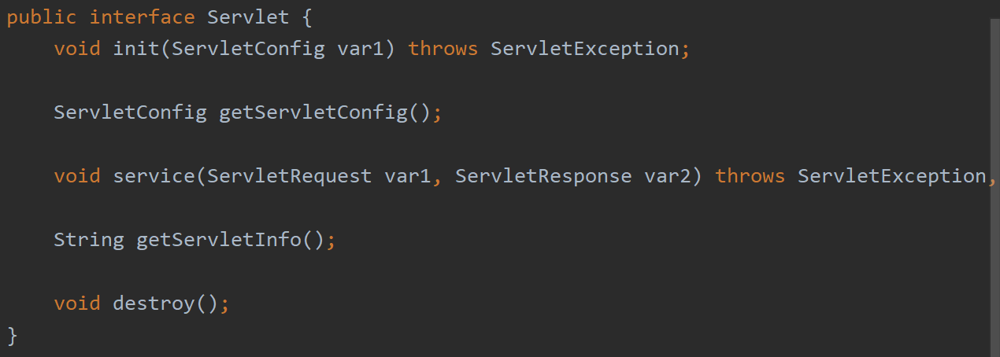
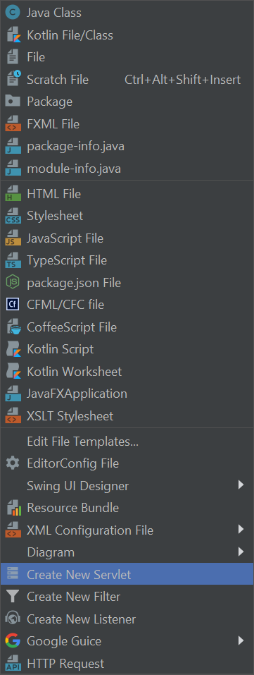
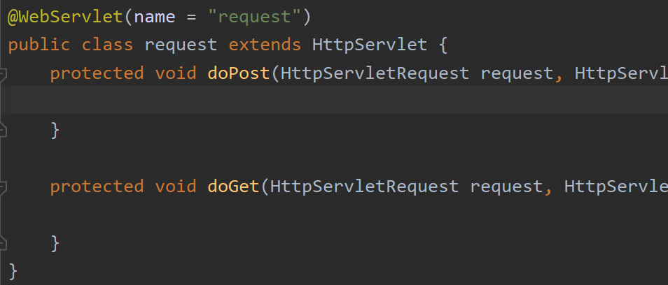
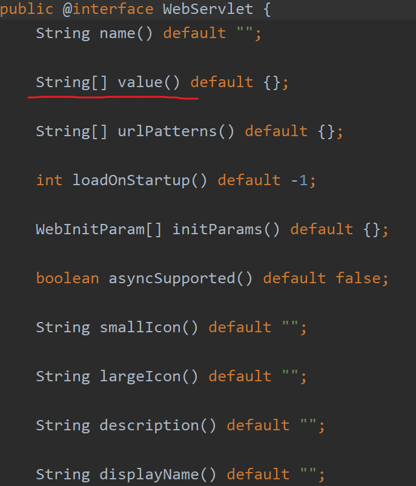
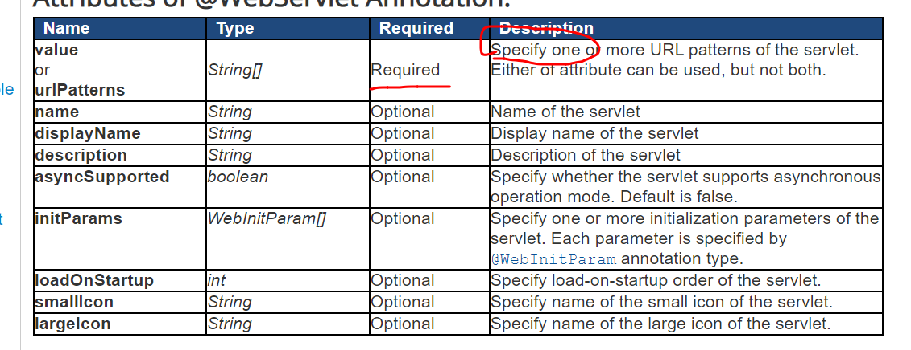

# Servlet quickstart

## 什么是 Servlet

**Servlet 是一个接口，一种规范。**

里面定义了 3 个方法：

1. `init` —— 初始化
2. `service` —— 你需要做什么？
3. `destory` —— 销毁

## 为什么要学习 Servlet

`Servlet`这个词实际上是`Server`和`applet`的组合词。

`Servlet`就是实现了`web application`，主要用于对`HTTP`发来的请求做出特定的回应。

## 步骤

**首先，什么是`@WebServlet`？他有什么作用？**

`@WebServlet`是注解，当用户在浏览器输入`URL`时，tomcat 需要根据你输入的`URL Pattern`找到特定的`Servlet`，来执行`Servlet`实现类的`service`具体方法，完成特定需求（这样你才能从浏览器中看到你所需要的资源）。

查看源码可知，`WebServlet`也是一个接口，里面有一些成员变量（属性）。

这里只需重点知道`value`这个属性是必填项，匹配特定的`URL patterns`

## 执行原理

## 生命周期

`init` 和 `destory` 执行一次；

`service`可执行多次。

## Servlet 体系结构

